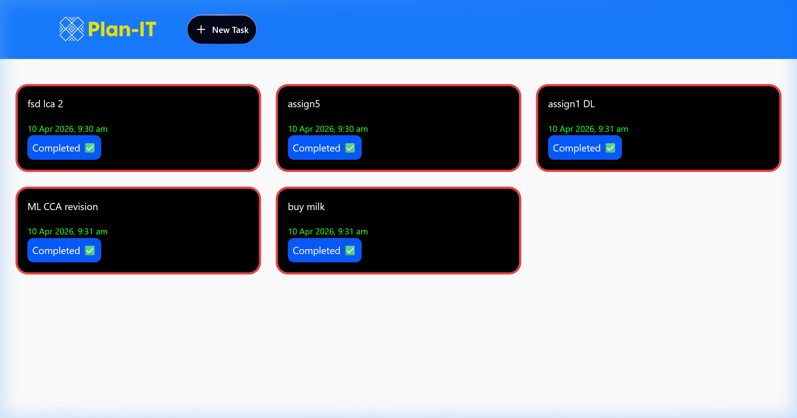
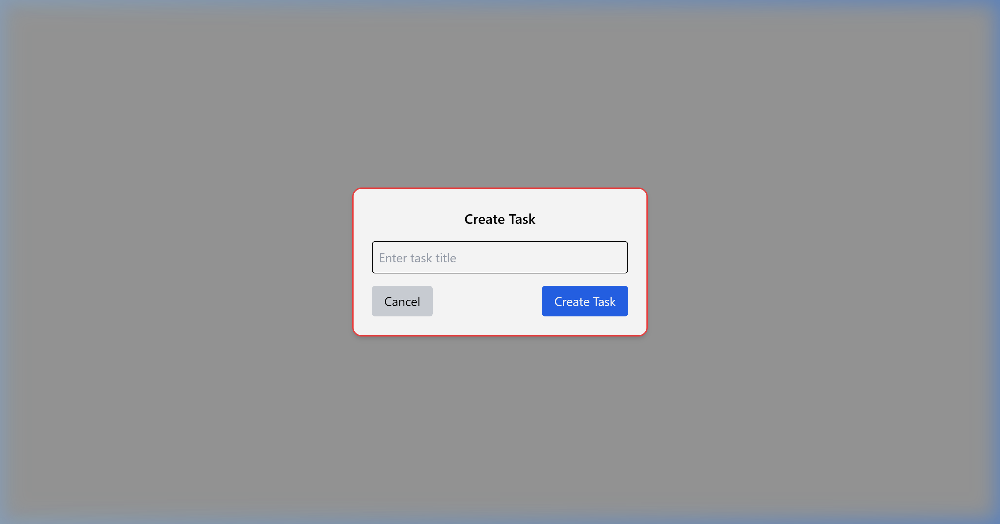

# 🗓️ Plan-It

**Plan-It** is a sophisticated task management application designed to help users organize their daily activities with ease. Built with a modern tech stack, it features a sleek UI, smooth animations, and a robust backend.

## 🚀 Key Features

- **Intuitive Dashboard**: View all your tasks in a clean, card-based layout.
- **Seamless Task Creation**: Quickly add new tasks with our user-friendly interface.
- **Real-time Updates**: Experience instant feedback when managing your tasks.
- **Responsive Design**: Fully functional on desktop, tablet, and mobile devices.
- **Elegant Animations**: Smooth transitions powered by Framer Motion.
- **Modern UI Components**: Styled with Tailwind CSS and DaisyUI for a premium feel.

## 🛠️ Tech Stack

### Frontend
- **Framework**: React 19
- **Build Tool**: Vite
- **Styling**: Tailwind CSS & DaisyUI
- **Animations**: Framer Motion
- **Icons**: Lucide React
- **State Management**: React Hooks
- **Routing**: React Router 7
- **HTTP Client**: Axios

### Backend
- **Runtime**: Node.js
- **Framework**: Express.js
- **Database**: MongoDB (Mongoose ODM)
- **Environment**: dotenv
- **Security**: CORS & Rate Limiting

## 📸 Screenshots

### Home Dashboard


### Create New Task


## ⚙️ Getting Started

### Prerequisites
- Node.js installed on your machine
- A MongoDB Atlas account or local MongoDB instance

### Installation

1. **Clone the repository**:
   ```bash
   git clone https://github.com/DotHrishi/Plan-It.git
   cd Plan-It
   ```

2. **Setup Backend**:
   ```bash
   cd backend
   npm install
   ```
   Create a `.env` file in the `backend` directory and add your MongoDB URI:
   ```env
   MONGODB_URI=your_mongodb_uri
   PORT=3000
   ```
   Start the backend:
   ```bash
   npm start
   ```

3. **Setup Frontend**:
   ```bash
   cd ../frontend
   npm install
   npm run dev
   ```

4. **Access the App**:
   Open `http://localhost:5173` in your browser.

## 📁 Project Structure

```text
Plan-It/
├── frontend/             # React frontend
│   ├── src/
│   │   ├── components/   # Reusable UI components
│   │   ├── pages/        # Application pages
│   │   ├── lib/          # Utilities and configurations
│   │   └── App.jsx       # Main application component
├── backend/              # Node.js backend
│   ├── src/
│   │   ├── models/       # Mongoose schemas
│   │   ├── routes/       # API endpoints
│   └── server.js         # Backend entry point
└── screenshots/          # Project images
```

## 👨‍💻 Author

**Hrishikesh Kali**
- GitHub: [@DotHrishi](https://github.com/DotHrishi)

---
*Developed with ❤️ for productivity.*
